Hi there! 👋 I am an experienced software developer with a passion for building modern, scalable applications and tackling complex challenges. With strong expertise in backend and frontend technologies, I create high-performance solutions that deliver outstanding user experiences. I also specialize in **graphics programming** to bring engaging visuals to life.

💡 I’m passionate about continuous learning and contributing to open-source projects. Feel free to explore my repositories and get in touch if you’re interested in collaborating!

  

  

